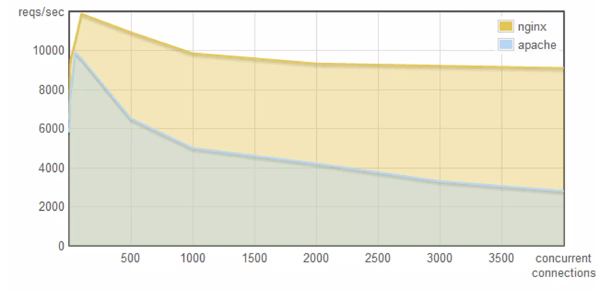
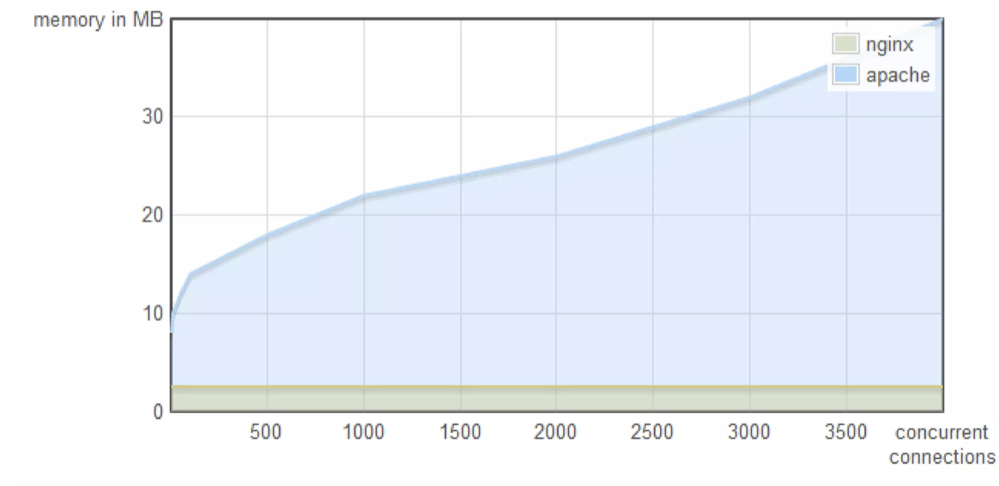

# 2009 Ryan Dahl: Node.js

### Key Dates

- **2008**: Google releases Chrome and open-sources V8 JavaScript engine
- **Early 2009**: Ryan Dahl begins experimenting with server-side JavaScript using V8
- **May 27, 2009**: First version of Node.js released
- **November 8, 2009**: Ryan Dahl introduces Node.js at JSConf EU in Berlin (see [video](https://www.youtube.com/watch?v=EeYvFl7li9E), conference [page](https://www.jsconf.eu/2009/speaker/speakers_selected.html))

## Slides

### Node.js - Original slides from Ryan Dahl's intro talk
**By: ry@tinyclouds.org**  
**Date: November 8, 2009**

---

### Slide 1: Title
**node.js**  
ry@tinyclouds.org  
November 8, 2009

---

### Slide 2: Node.js in Brief
- Server-side Javascript
- Built on Google's V8
- Evented, non-blocking I/O. Similar to EventMachine or Twisted.
- CommonJS module system.
- 8000 lines of C/C++, 2000 lines of Javascript, 14 contributors.

---

### Slide 3: The Problem
**I/O needs to be done differently.**

---

### Slide 4: Blocking I/O Example

Many web applications have code like this:

```javascript
var result = db.query("select * from T");
// use result
```
What is the software doing while it queries the database?

---

### Slide 5: Waiting

In many cases, just waiting for the response.

---

### Slide 6: I/O Latency

- L1: 3 cycles
- L2: 14 cycles
- RAM: 250 cycles
- DISK: 41,000,000 cycles
- NETWORK: 240,000,000 cycles

---

### Slide 7: Multitasking Solution

Better software can multitask.  
Other threads of execution can run while waiting.

---

### Slide 8: Can We Do Better?

Is that the best that can be done?  
A look at Apache and NGINX.

---

### Slide 9: Apache vs NGINX - Performance

**concurrency × reqs/sec**  



http://blog.webfaction.com/a-little-holiday-present

---

### Slide 10: Apache vs NGINX - Memory

**concurrency × memory**  




http://blog.webfaction.com/a-little-holiday-present

---

### Slide 11: The Difference

**Apache vs NGINX**  
The difference?
- Apache uses one thread per connection.
- NGINX doesn't use threads. It uses an event loop.

---

### Slide 12: Thread Limitations

- Context switching is not free
- Execution stacks take up memory
- For massive concurrency, cannot use an OS thread for each connection.

---

### Slide 13: Green Threads

Green threads or coroutines can improve the situation dramatically  
BUT there is still machinery involved to create the illusion of holding execution on I/O.

---

### Slide 14: Leaky Abstraction

**Threaded concurrency is a leaky abstraction.**

---

### Slide 15: The Problem with Blocking

Code like this:

```javascript
var result = db.query("select..");
// use result
```

either blocks the entire process or implies multiple execution stacks.

---

### Slide 16: Non-blocking Solution

But a line of code like this:

```javascript
db.query("select..", function (result) {
  // use result
});
```

allows the program to return to the event loop immediately.  
No machinery required.

---

### Slide 17: The Right Way

```javascript
db.query("select..", function (result) {
  // use result
});
```

**This is how I/O should be done.**

---

### Slide 18: Why Not Everyone?

So why isn't everyone using event loops, callbacks, and non-blocking I/O?  
For reasons both cultural and infrastructural.

---

### Slide 19: Cultural Bias - Traditional I/O

**Cultural Bias**  

We're taught I/O with this:

```javascript
puts("Enter your name: ");
var name = gets();
puts("Name: " + name);
```

We're taught to demand input and do nothing until we have it.

---

### Slide 20: Cultural Bias - Callbacks Rejected

**Cultural Bias**  

Code like:

```javascript
puts("Enter your name: ");
gets(function (name) {
   puts("Name: " + name);
});
```

is rejected as too complicated.

---

### Slide 21: Missing Infrastructure - Libraries

**Missing Infrastructure**  

So why isn't everyone using event loops?  
Single threaded event loops require I/O to be non-blocking  
Most libraries are not.

---

### Slide 22: Missing Infrastructure - Details

**Missing Infrastructure**

- POSIX async file I/O not available.
- Man pages don't state if a function will access the disk. (e.g getpwuid())
- No closures or anonymous functions in C; makes callbacks difficult.
- Database libraries (e.g. libmysql client) do not provide support for asynchronous queries
- Asynchronous DNS resolution not standard on most systems.

---

### Slide 23: Too Much Infrastructure - Confusion

**Too Much Infrastructure**  
EventMachine, Twisted, AnyEvent provide very good event loop platforms.  
Easy to create efficient servers.  
But users are confused how to combine with other available libraries.

---

### Slide 24: Expert Knowledge Required

**Too Much Infrastructure**  
Users still require expert knowledge of event loops, non-blocking I/O.

---

### Slide 25: JavaScript's Advantages

Javascript designed specifically to be used with an event loop:

- Anonymous functions, closures.
- Only one callback at a time.
- I/O through DOM event callbacks.

---

### Slide 26: JavaScript Culture

The culture of Javascript is already geared towards evented programming.

---

### Slide 27: The Node.js Project

**This is the node.js project:**  
To provide a purely evented, non-blocking infrastructure to script highly concurrent programs.

---

### Slide 28: Design Goals - No Direct I/O

**Design Goals**  
No function should direct perform I/O.  
To receive info from disk, network, or another process there must be a callback.

---

### Slide 29: Design Goals - Low-level

**Design Goals**
- Low-level.
- Stream everything; never force the buffering of data.
- Do not remove functionality present at the POSIX layer. For example, support half-closed TCP connections.

---

### Slide 30: Design Goals - Protocol Support

**Design Goals**  
Have built-in support for the most important protocols:
- TCP
- DNS
- HTTP

---

### Slide 31: Design Goals - HTTP Features

**Design Goals**  
Support many HTTP features:
- Chunked requests and responses.
- Keep-alive.
- Hang requests for comet applications.

---

### Slide 32: Design Goals - API Familiarity

**Design Goals**  
The API should be both familiar to client-side JS programmers and old school UNIX hackers.  
Be platform independent.

---

### Slide 33: Usage and Examples

**Usage and Examples**  
(using node 0.1.16)

---

### Slide 34: Installation

Download, configure, compile, and make install it.  
http://nodejs.org/  
No dependencies other than Python for the build system. V8 is included in the distribution.

---

### Slide 35: Hello World Example

```javascript
var sys = require("sys");
setTimeout(function () {
  sys.puts("world");
}, 2000);
sys.puts("hello");
```
A program which prints "hello", waits 2 seconds, outputs "world", and then exits.

---

### Slide 36: Auto Exit

```javascript
var sys = require("sys");
setTimeout(function () {
  sys.puts("world");
}, 2000);
sys.puts("hello");
```

Node exits automatically when there is nothing else to do.

---

### Slide 37: Running the Example

```bash
% node hello_world.js
hello
# 2 seconds later...
% node hello_world.js
hello
world
%
```

---

### Slide 38: Signal Handling

Change the "hello world" program to loop forever, but print an exit message when the user kills it.  
We will use the special object `process` and the `"SIGINT"` signal.

---

### Slide 39: Signal Handling Code

```javascript
puts = require("sys").puts;

setInterval(function () {
  puts("hello");
}, 500);

process.addListener("SIGINT",
  function () {
    puts("good bye");
    process.exit(0)
  });
```

---

### Slide 40: Process Event Listener

```javascript
process.addListener("SIGINT", ...);
```

The process object emits an event when it receives a signal. Like in the DOM, you need only add a listener to catch them.

---

### Slide 41: Process Object Properties

Also:

- `process.pid`
- `process.ARGV`
- `process.ENV`
- `process.cwd()`
- `process.memoryUsage()`

---

### Slide 42: Event Emitters

Like process, many other objects in Node emit events.

---

### Slide 43: Event Examples

- A TCP server emits a `"connection"` event each time someone connects.
- An HTTP upload emits a `"body"` event on each packet.

---

### Slide 44: EventEmitter Base

All objects which emit events are instances of `process.EventEmitter`.

---

### Slide 45: TCP Server Task

Write a program which:
- starts a TCP server on port 8000
- send the peer a message
- close the connection

---

### Slide 46: TCP Server Example

```javascript
var tcp = require("tcp");

var s = tcp.createServer();
s.addListener("connection",
  function (c) {
    c.send("hello!");
    c.close();
  });

s.listen(8000);
```

---

### Slide 47: Testing the Server

```bash
% node server.js &
[1] 9120
% telnet localhost 8000
Trying 127.0.0.1...
Connected to localhost.
Escape character is '^]'.
hello!
Connection closed by foreign host.
%
```

---

### Slide 48: Simplified Version

The `"connection"` listener can be provided as the first argument to `tcp.createServer()`, so the program can be simplified:

---

### Slide 49: Simplified TCP Server

```javascript
var tcp = require("tcp");
tcp.createServer(function (c) {
  c.send("hello!\n");
  c.close();
}).listen(8000);
```

---

### Slide 50: Non-blocking File I/O

File I/O is non-blocking too.  
(Something typically hard to do.)

---

### Slide 51: File Stat Example

As an example, a program that outputs the last time `/etc/passwd` was modified:

```javascript
var stat = require("posix").stat,
    puts = require("sys").puts;

var promise = stat("/etc/passwd");

promise.addCallback(function (s) {
  puts("modified: " + s.mtime);
});
```

---

### Slide 52: Promises

A promise is a kind of `EventEmitter` which emits either `"success"` or `"error"`. (But not both.)  
All file operations return a promise.

---

### Slide 53: Promise Syntax Sugar

```javascript
promise.addCallback(cb)
```

is just API sugar for:

```javascript
promise.addListener("success", cb)
```

---

### Slide 54: Simple HTTP Server

```javascript
var http = require("http");

http.createServer(function (req,res) {
  res.sendHeader(200,
    {"Content-Type": "text/plain"});
  res.sendBody("Hello\r\n");
  res.sendBody("World\r\n");
  res.finish();
}).listen(8000);
```

---

### Slide 55: HTTP Server Output

```bash
% node http_server.js &
[4] 27355
% curl -i http://localhost:8000/
HTTP/1.1 200 OK
Content-Type: text/plain
Connection: keep-alive
Transfer-Encoding: chunked

Hello
World
%
```

---

### Slide 56: Streaming HTTP Server

```javascript

var http = require("http");
http.createServer(function (req,res) {
  res.sendHeader(200,
    {"Content-Type": "text/plain"});

  res.sendBody("Hel");
  res.sendBody("lo\r\n");

  setTimeout(function () {
   res.sendBody("World\r\n");
   res.finish();
  }, 2000);
}).listen(8000);
```

---

### Slide 57: Streaming HTTP Output

```bash
% node http_server2.js &
[4] 27355
% curl http://localhost:8000/
Hello
# Two seconds later...
% node http_server2.js &
[4] 27355
% curl http://localhost:8000/
Hello
World
%
```

---

### Slide 58: Executing Programs

```javascript
var sys = require("sys");
sys.exec("ls -l /")
  .addCallback(function (output) {
    sys.puts(output);
  });
```

Programs can be run with `sys.exec()`

---

### Slide 59: Streaming Child Processes

But Node never forces buffering  
∃ a lower-level facility to stream data through the STDIO of the child processes.  

Simple IPC.

---

### Slide 60: Child Process Example

```javascript
var puts = require("sys").puts;

var cat =
  process.createChildProcess("cat");

cat.addListener("output",
  function (data) {
    if (data) sys.puts(data);
  });

cat.write("hello ");
cat.write("world\n");
cat.close();
```

---

### Slide 61: Demo / Experiment

An IRC Daemon written in javascript.  
irc.nodejs.org  
#node.js  
Source code:
- http://tinyurl.com/ircd-js
- http://gist.github.com/a3d0bbbff196af633995

---

### Slide 62: Internal Design

---

### Slide 63: Dependencies

- **V8** (Google)
- **libev** event loop library (Marc Lehmann)
- **libeio** thread pool library (Marc Lehmann)
- **http-parser** a ragel HTTP parser (Me)
- **evcom** stream socket library on top of libev (Me)
- udns non-blocking DNS resolver (Michael Tokarev)

---

### Slide 64: Thread Pool Usage

Blocking (or possibly blocking) system calls are executed in the thread pool.  

Signal handlers and thread pool callbacks are marshaled back into the main thread via a pipe.

---

### Slide 65: File Descriptor Limitations

```bash
% node myscript.js < hugefile.txt
```

STDIN_FILENO will refer to a file.  
Cannot select() on files;  
read() will block.

---

### Slide 66: Pumping Thread Solution

Solution: Start a pipe, and a "pumping thread".  
Pump data from blocking fd into pipe.  
Main thread can poll for data on the pipe.  
(See deps/coupling if you're interested)

---

### Slide 67: Future Plans

- Fix API warts.
- More modularity; break Node into shared objects.
- Include libraries for common databases in distribution.
- Improve performance.
- TLS support
- Web Worker-like API. (Probably using ChildProcess)

---

### Slide 68: Version 0.2 Timeline

**Future**  
Version 0.2 in late December or January.  
Core API will be frozen.

---

### Slide 69: Questions

**Questions...?**  
http://nodejs.org/  
ry@tinyclouds.org

---

## Summary
This presentation introduced Node.js as a server-side JavaScript platform built on V8 with non-blocking, event-driven I/O. The key points covered:

1. **The Problem**: Traditional blocking I/O wastes resources during wait times
2. **The Solution**: Event loops and callbacks allow efficient handling of concurrent connections
3. **Why JavaScript**: Already designed for event-driven programming with closures and callbacks
4. **Design Goals**: Non-blocking everything, low-level control, streaming data, protocol support
5. **Examples**: TCP servers, HTTP servers, file I/O, child processes - all non-blocking
6. **Architecture**: Built on V8, libev, libeio, and other proven libraries

The presentation was given in November 2009 when Node.js was at version 0.1.16 with plans for version 0.2.