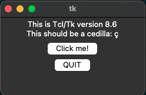

---
tags:
  - python
---

# Python Desktop GUI Libraries

## Popular Libraries

| Name | Github stars  | Licence |
|------|---------------|---------|
| [Tkinter](https://docs.python.org/3/library/tkinter.html) | - | PSF |
| [PySimpleGUI](https://github.com/PySimpleGUI/PySimpleGUI) | 12.2k |  LGPL-3.0 | 
| [Kivy](https://github.com/kivy/kivy) | 3.1k | MIT | 
| [PyQT](https://www.riverbankcomputing.com/software/pyqt/) | - | GPL v3; Riverbank Commercial License | 
| [wxPython/Phoenix](https://github.com/wxWidgets/Phoenix) | 500+| [wxWindows Library Licence](https://wxpython.org/pages/license/)|

**Other libs**: [PyGTK](http://www.pygtk.org), [PySide](https://doc.qt.io/qtforpython-6),  [PyForms GUI](https://github.com/UmSenhorQualquer/pyforms-gui).

For now, I am interesting in **Tkinter** and related libraries (i.e. **PySimpleGUI**).

## Tkinter and Co.

- [CustomTkinter](https://github.com/TomSchimansky/CustomTkinter) is a python UI-library based on Tkinter, which provides new, modern and fully customizable widgets
- [Tkinter Designer](https://github.com/ParthJadhav/Tkinter-Designer) was created to speed up the GUI development process in Python. It uses the well-known design software Figma to make creating beautiful Tkinter GUIs in Python a piece of cake
- [ttkbootstrap](https://github.com/israel-dryer/ttkbootstrap) is a supercharged theme extension for tkinter that enables on-demand modern flat style themes inspired by Bootstrap

## Python3 is not configured for Tk

From the official [documentation](https://docs.python.org/3/library/tkinter.html):

> Running `python -m tkinter` from the command line should open a window demonstrating a simple Tk interface, letting you know that tkinter is properly installed on your system, and also showing what version of Tcl/Tk is installed, so you can read the Tcl/Tk documentation specific to that version.

```shell
➜ python3 -m tkinter
Traceback (most recent call last):
  File "<frozen runpy>", line 189, in _run_module_as_main
  File "<frozen runpy>", line 148, in _get_module_details
  File "<frozen runpy>", line 112, in _get_module_details
  File "/opt/homebrew/Cellar/python@3.11/3.11.5/Frameworks/Python.framework/Versions/3.11/lib/python3.11/tkinter/__init__.py", line 38, in <module>
    import _tkinter # If this fails your Python may not be configured for Tk
    ^^^^^^^^^^^^^^^
ModuleNotFoundError: No module named '_tkinter'
```

See more details about this issue on SO [Why does tkinter (or turtle) seem to be missing or broken? Shouldn't it be part of the standard library?](https://stackoverflow.com/questions/76105218/why-does-tkinter-or-turtle-seem-to-be-missing-or-broken-shouldnt-it-be-part)

**Fix log on MacOS:**

You need to install `python-tk@3.11`.

```shell
➜ python3 -m tkinter
Traceback (most recent call last):
  File "<frozen runpy>", line 189, in _run_module_as_main
  File "<frozen runpy>", line 148, in _get_module_details
  File "<frozen runpy>", line 112, in _get_module_details
  File "/opt/homebrew/Cellar/python@3.11/3.11.5/Frameworks/Python.framework/Versions/3.11/lib/python3.11/tkinter/__init__.py", line 38, in <module>
    import _tkinter # If this fails your Python may not be configured for Tk
    ^^^^^^^^^^^^^^^
ModuleNotFoundError: No module named '_tkinter'

➜ python3 -V
Python 3.11.5

➜ brew install python-tk@3.11
Running `brew update --auto-update`..
...

➜ python3 -V
Python 3.11.6

➜ python3 -m tkinter
```

