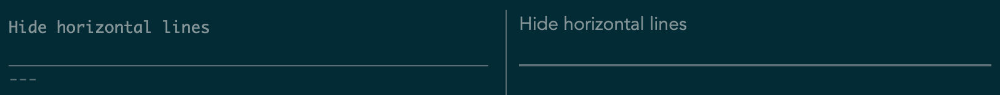
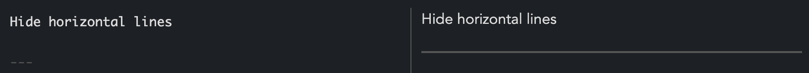

---
tags:
  - joplin
---

# Joplin

## Set TOC depth to 2nd levels

- [Desktop, Mobile: Update Markdown plugins: toc-done-right, anchor #2005](https://github.com/laurent22/joplin/pull/2005)

```text
$<toc{"level":[2]}>
```

```text
$<toc{"level":[1,2,3],"listType":"ol"}>
```

## Hide horizontal lines in the markdown pane

- [Horizontal Lines being rendered in the markdown pane on Solarized Themes #4210](https://github.com/laurent22/joplin/issues/4210)

> This is a feature of the Solarized theme that Joplin relies on. If you don't like the line you can switch to another theme, or use custom css to style Joplin however you like.

I switched to default Dark theme and it works properly

- Solarized theme


- Dark theme

