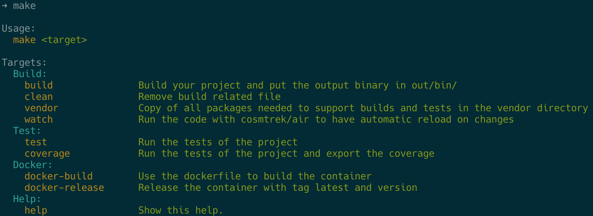

# make

## Resources

- [GNU Make Manual](https://www.gnu.org/software/make/manual/)
- [Makefile Tutorial](https://makefiletutorial.com)

## Colored Help



??? example

    See origin [My Ultimate Makefile for Golang Projects](https://betterprogramming.pub/my-ultimate-makefile-for-golang-projects-fcc8ca20c9bb)

    ```make
    GREEN  := $(shell tput -Txterm setaf 2)
    YELLOW := $(shell tput -Txterm setaf 3)
    WHITE  := $(shell tput -Txterm setaf 7)
    CYAN   := $(shell tput -Txterm setaf 6)
    RESET  := $(shell tput -Txterm sgr0)

    all: help

    ## Build:
    build: ## Build your project and put the output binary in out/bin/
        @echo "build target"

    clean: ## Remove build related file
        @echo clean target

    vendor: ## Copy of all packages needed to support builds and tests in the vendor directory
        @echo vendor target

    watch: ## Run the code with cosmtrek/air to have automatic reload on changes
        @echo watch target
        
    ## Test:
    test: ## Run the tests of the project
        @echo test target

    coverage: ## Run the tests of the project and export the coverage
        @echo coverage target

    ## Docker:
    docker-build: ## Use the dockerfile to build the container
        @echo docker-build target

    docker-release: ## Release the container with tag latest and version
        @echo docker-release target

    ## Help:
    help: ## Show this help.
        @echo ''
        @echo 'Usage:'
        @echo '  ${YELLOW}make${RESET} ${GREEN}<target>${RESET}'
        @echo ''
        @echo 'Targets:'
        @awk 'BEGIN {FS = ":.*?## "} { \
            if (/^[a-zA-Z_-]+:.*?##.*$$/) {printf "    ${YELLOW}%-20s${GREEN}%s${RESET}\n", $$1, $$2} \
            else if (/^## .*$$/) {printf "  ${CYAN}%s${RESET}\n", substr($$1,4)} \
            }' $(MAKEFILE_LIST)
    ```
