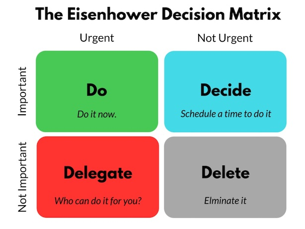
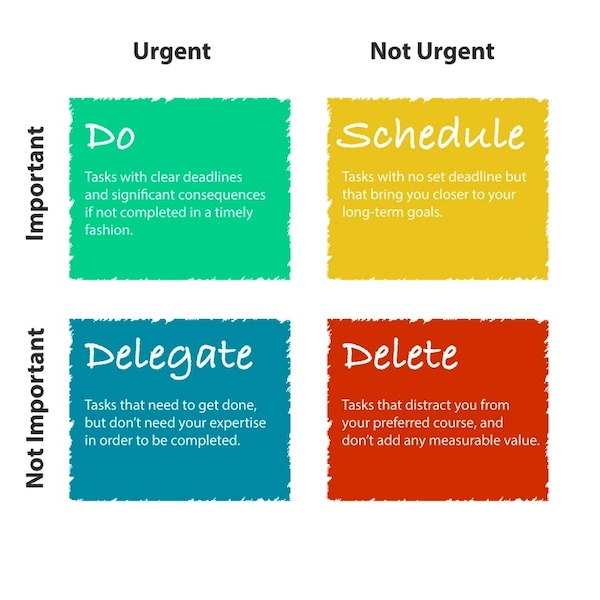

---
tags:
  - productivity 
---

# Eisenhower Matrix

> "I have two kinds of problems: the urgent and the important. The urgent are not important, and the important are never urgent." — Dwight D. Eisenhower

The core principle behind the Eisenhower Matrix is the distinction between **important** and **urgent** tasks.

**Urgent** tasks are time-sensitive and demand your attention. They’re tasks you feel obligated to address. Focusing on urgent tasks puts you in a reactive mindset, which can make you feel defensive, rushed, and narrowly focused.

**Important** tasks contribute to your long-term mission, values, and goals. They may not yield immediate results (making them easy to neglect). Sometimes important tasks are also urgent — but usually not. Focusing on important tasks puts you in a responsive mindset, which can make you feel calm, rational, and open to new ideas.

The Eisenhower Matrix is divided into four parts:

- Quadrant 1: Important and urgent / Do
- Quadrant 2: Important but not urgent / Schedule
- Quadrant 3: Urgent but not important / Delegate
- Quadrant 4: Not important, not urgent / Delete

**References**

- [The Eisenhower Matrix: How to prioritize your to-do list](https://asana.com/resources/eisenhower-matrix)
- [The Eisenhower Matrix: Prioritize Your Time on What Matters Most](https://slab.com/blog/eisenhower-matrix/)
- [How to Use the Prioritization Matrix When Every Task is #1](https://www.lifehack.org/876079/prioritization-matrix)