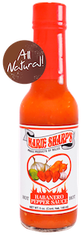
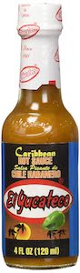
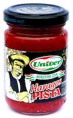
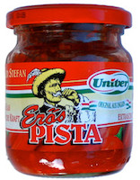
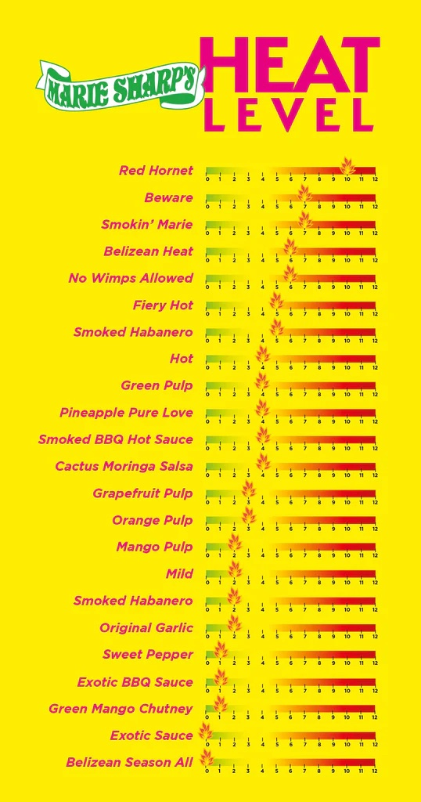
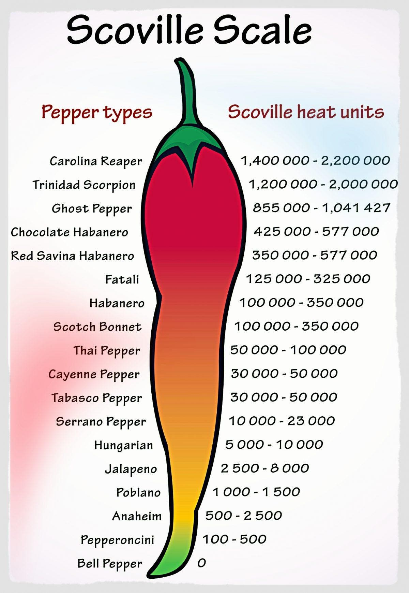
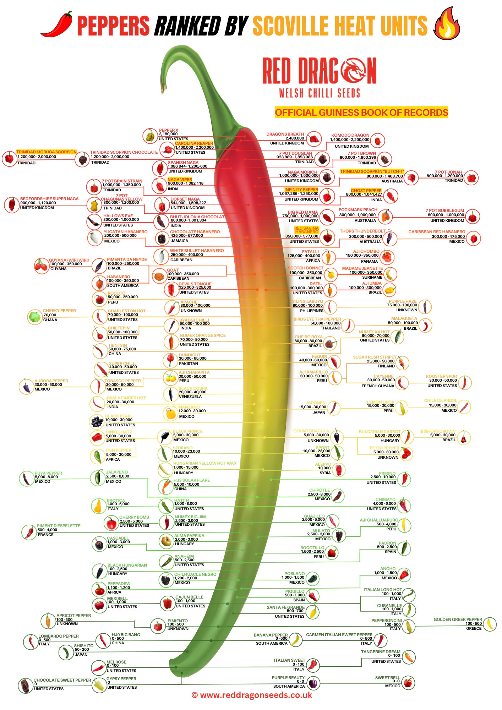

# Hot Sauces

## References

- https://pepperscale.com/hot-sauce-rankings/
- [Scoville Heat Units Pepper Chart](https://www.reddragonseeds.co.uk/scoville-heat-units-pepper-chart/)

## Tasted Hot Sauces

No. | Image | Name | When | Comments 
 -- | -- | -- | -- | --
1 |  | [**_Marie Sharp’s_** Hot](https://marie-sharp.de/products/hot) | Oct 2023 | Spicy
2 |  | [**El Yucateco** Caribbean Chile Habañero](https://www.scovilla.com/de/hot-sauces/1095/el-yucateco-caribbean-chile-habanero-hot-sauce-120ml)  | Oct 2023 | Spicy
3 |  | [Haragos Pista](https://www.uborn-direkt.de/eroes-pista-starker-stefan-haragos-pista-extra-pista) | Nov 2023 | Very spicy, PITA
4 |  | [Erös Pista](https://www.uborn-direkt.de/eroes-pista-starker-stefan-ungarische-paprikacreme-extra-scharf) | Nov 2023 | Mild 

## Marie Sharp - Heat Level Table

## Scoville Scale

