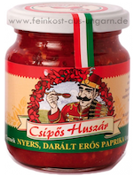
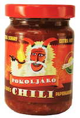
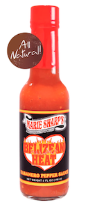
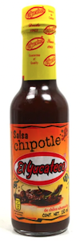

# Hot Sauces

## References

- https://pepperscale.com/hot-sauce-rankings/
- [Scoville Heat Units Pepper Chart](https://www.reddragonseeds.co.uk/scoville-heat-units-pepper-chart/)

## Tasted Hot Sauces

No. | Image | Name | When | Comments 
 -- | -- | -- | -- | --
1 |  | [**_Marie Sharp’s_** Hot](https://marie-sharp.de/products/hot) | Oct 2023 | Spicy
2 |  | [**El Yucateco** Caribbean Chile Habañero](https://www.scovilla.com/de/hot-sauces/1095/el-yucateco-caribbean-chile-habanero-hot-sauce-120ml)  | Oct 2023 | Spicy
3 |  | [Haragos Pista](https://www.uborn-direkt.de/eroes-pista-starker-stefan-haragos-pista-extra-pista) | Nov 2023 | Very spicy, PITA
4 |  | [Erös Pista](https://www.uborn-direkt.de/eroes-pista-starker-stefan-ungarische-paprikacreme-extra-scharf) | Nov 2023 | Mild 
5 |  | [Csipös Huszár - scharfe Paprikapaste 210g  Chili Trade](https://www.uborn-direkt.de/csipoes-huszar-scharfe-paprikapaste-210g-chili-trade) | Jan 2024  |Mild
6 |  | [Pokoljáró Chili](https://www.little-hungary-shop.de/p/pokoljaro-chili-rohres-scharfes-chilipaprika-chili-trade) | Jan 2024 | Spicy
7 |  | [Belizean Heat](https://marie-sharp.de/products/belizean-heat) | Feb 2024 | Spicy
8 |  | [Salsa Picante de Chile Chipotle EL YUCATECO](https://porto-brasil.de/Salsa-Picante-de-Chile-Chipotle-EL-YUCATECO-Chipotle-Chili-Sauce-Flasche-150-ml) | Feb 2024 | Light

## Marie Sharp - Heat Level Table

## Scoville Scale

